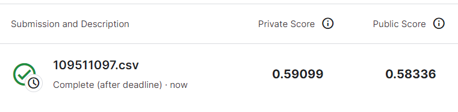

# Tabular Playground Series - Aug 2022

This repository is my implementation of Kaggle competition [Tabular Playground Series - Aug 2022](https://www.kaggle.com/competitions/tabular-playground-series-aug-2022). 

## Reproducing submission <!-- omit in toc -->

To reproduce the submission, do the following steps:

1. [Install requirements](#requirements-)
2. Either [train the model](#training-) or [download pre-trained model](#pre-trained-models-)
3. [Inference](#inference-)

## Requirements <!-- omit in toc -->

To install requirements:

```setup
pip install -r requirements.txt
```

## Training <!-- omit in toc -->

To train the model, run this command:

```train
python train.py
```

## Inference <!-- omit in toc -->

To generate `submission.csv`, run:

```inference
python inference.py
```

## Pre-trained Models <!-- omit in toc -->

You can download pretrained models here:

- [My model (Tabular Playground Series - Aug 2022)](https://drive.google.com/drive/folders/1wObwEOhzw-oZiYgbFrYTKugCwZaobdkG?usp=share_link)

## Results <!-- omit in toc -->

  